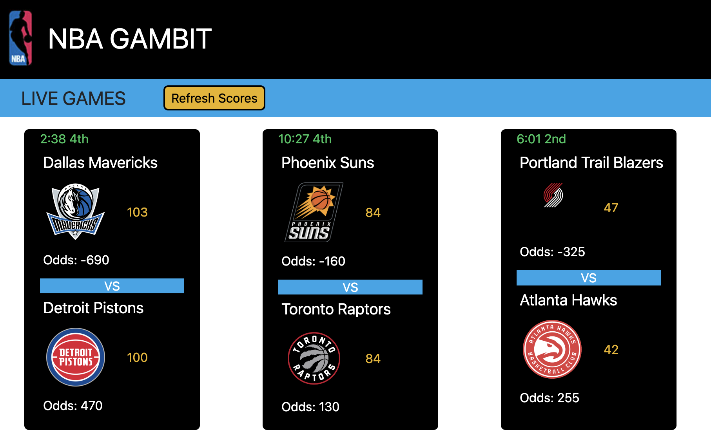

# NBA-GAMBIT

## Deployed URL: 

## Description

The provided URL above links to NBA-GAMBIT deployed page that allows the user to utilize the webpage to monitor Live NBA Games.

It shall contain the following features and information:

<ul>
<li>The page shall populate live games within its cards to show the following:</li>
<ul>
<li>Current Quarter</li> 
<li>Time left in the quarter</li>
<li>Team Names</li>
<li>Team Logos</li>
<li>Live Scores</li>
<li>Live Odds</li>
</ul>
<li>A refresh scores button at the top of the page to update the current game, scores, and odds.</li>
</ul>

## Usage

NBA-GAMBIT is intended to be used by game bettors to track their bets with ongoing live games in the standard league of the NBA.

<ul>
<li>Each card will populate the necessary data for the bettor to determine on whom to bet on with the statistics given in each game card.</li>
<li>Live Scores and Odds will help the user to decide on which team to bet on or to monitor their pre-game bets.</li>
<li>It may also be used by a fan, that has no intentions of betting, by tracking live game statistics for their favorite teams.</li>
</ul>

## Page Preview

The following page previews has been added to further exhibit the functionality - 

## Contributors

<ul>
<li>Andrew Allemond - https://github.com/aallemond</li>
<li>Manual Corral - https://github.com/ecinematic</li>
<li>Tim Johnson - https://github.com/timjohnson818</li>
<li>Irene Joo - https://github.com/ir3nejoo</li>
<li>Danielle Sison - https://github.com/DanielleSison</li>
</ul>

## Credits

Credits to the following content below that served as a resource for the developers:

<ul>
<li>CSS Framework - TailwindCSS - https://tailwindcss.com/</li>
<li>First Server-side API - API-NBA - https://rapidapi.com/api-sports/api/api-nba</li>
<li>Second Server-side API - Live Sports Odds - https://rapidapi.com/theoddsapi/api/live-sports-odds</li>
<li>Thank you to our instuctor and TA's that had helped us build this project 😁 </li>
</ul>

## License

N/A
